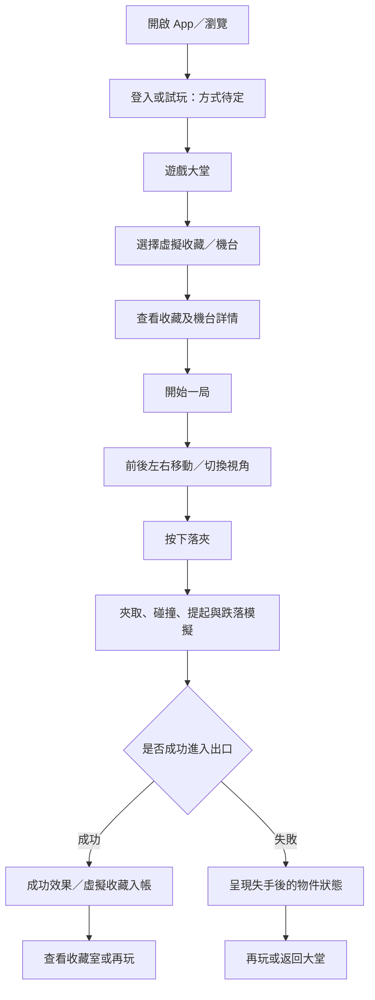
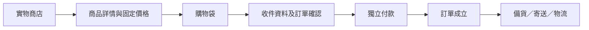

# 夾夾島 — 產品方向與遊戲設計

版本：0.8（本機 版本 0.4 關卡制更新） · 更新日期：2026-09-22  
狀態：30 關可玩網頁 版本 已實作並驗證；正式 iOS／Android App 尚未開發。  
「夾夾島」為工作名稱，尚未由用戶確認正式品牌名稱。

> **最新產品決定（版本 0.4）**：本文件早期的 B「3D 遊戲＋獨立實物商店」已被取代。產品現為純數碼關卡制夾爪遊戲；不提供實物獎勵、實物兌換、實物購買或線下寄送。以下第 2–20 節保留部分歷史記錄時，以第 21 節為準。

## 1. 文件用途

記錄本次對話已確認的產品方向、玩法、視覺風格及後續待定事項，作為 Figma 設計及日後開發的共同依據。標示為「建議」或「待定」的內容，不等於用戶已批准。

## 2. 已確認的核心決定

| 項目 | 最新方向 |
| --- | --- |
| 平台 | 支援 Apple iPhone／iOS 及 Android |
| 產品模式 | **純數碼 3D 夾爪關卡遊戲** |
| 遊戲獎勵 | 成功夾取後取得數碼收藏、星數及示範金幣 |
| 實物購買 | **已完全移除；不設實物獎勵、兌換或寄送** |
| 美術方向 | **C：糖果啫喱／Candy Jelly** |
| 遊戲體驗 | 重現實體夾公仔的觀察、對準、落夾、提起、滑落及入出口體驗 |
| 物理要求 | 接觸位置、角度、碰撞及跌落過程可以自然變化，不只重播固定動畫 |
| 設計先行 | 開發之前先做逐頁 App 預覽，讓用戶手動調整 |
| 設計工具 | **Figma**；不使用 Canva |
| 文件 | 持續維護本 Project.md |

## 3. 已被取代的早期構思（歷史；B 方案亦已由第 21 節取代）

早期討論曾提出「付費玩虛擬 3D 機台，由後台機率決定是否贏取實物，再寄出獎品」。最新已選擇 B 方案，因此不再以這個模式作為第一版設計依據。

具體影響：

- 成功畫面顯示「已加入收藏室」，不顯示「已獲得實物」或「待寄送」。
- 遊戲收藏不可兌換現金、實物、實物購物金或實物折扣。
- 不要求玩家先夾中或完成關卡才可購買實物。
- 實物商品的可購買資格、價格、折扣及寄送權利，不由遊戲輸贏決定。
- 遊戲中的代幣／次數與實物商店的貨幣支付分開；不設兩者兌換功能。
- 收到實物的前提是獨立完成商品購買，而不是贏了一局遊戲。
- 不製作真機直播或遙控機台系統作為本輪方案。
- 過往「獎品櫃：待寄送」概念須改成「虛擬收藏室」與「實物訂單」兩種不同資料。

以上是產品設計邊界，不代表平台已核准或已完成法律審查。

## 4. 產品定位

一個可愛、具有收藏感的手機 3D 夾公仔遊戲，讓玩家享受親手對準、抓取及收集角色的樂趣；同一 App 另設獨立實物商店，提供明確商品、價格及訂單流程。

第一版體驗重點：

1. 玩家能看清楚爪、物件、機台深度及出口。
2. 玩家能理解操作與物理反應的關係。
3. 夾中時有清楚且愉快的回饋。
4. 虛擬收藏與實物購買不容易混淆。
5. 視覺吸引，但控制及文字保持清楚易讀。

## 5. 遊戲流程

### 5.1 操作設計：首版建議

- 手機直向畫面。
- 正面與側面兩個固定視角，協助判斷前後距離；不在首版加入任意旋轉鏡頭。
- 搖桿控制機台平面的前、後、左、右。
- 獨立「落夾」按鈕，下降、合爪及返回出口由機械流程控制。
- 暫不讓玩家獨立控制爪的高度；此為簡化操作的建議，未屬最終決定。
- 每局是否倒數、局長、次數／代幣成本、免費次數及重玩規則均待定。
- 再玩需要玩家主動操作，不自動開始下一局。

### 5.2 成功演出

對準 → 落夾 → 合爪 → 提起 → 移向出口 → 放開 → 物件跌入出口 → 確認結果 → 星星及音效 → 顯示「夾到喇！」。

確認成功後自動記錄虛擬收藏，不要求玩家再按一次才保存。結果畫面提供「查看收藏室」及「再玩一局」。

### 5.3 失敗演出

可能包括未碰到、單邊受力而傾斜、夾起後滑落、碰撞其他物件後翻滾等。具體反應由物理狀態及操作決定，不以每次強制不同作為要求。

建議文案：「今次未夾到」。提供「再玩一局」及「返回大堂」，不顯示虛構的差一點成功率或下局必中的承諾。

## 6. 物理模擬方向

### 6.1 基本原則

物理規則固定，結果可以隨初始狀態及玩家操作改變。相同條件下出現相近結果屬正常；目標是可信的變化，不是強迫每局獨一無二。

考慮因素：物件形狀、重量、重心、表面摩擦、彈性、爪接觸點、抓取角度、移動速度及物件間碰撞。

### 6.2 動作分工：建議

| 部分 | 處理方式 |
| --- | --- |
| 機械爪移動路線、下降、返回出口 | 受控制的機械動作 |
| 獎品的碰撞、傾斜、旋轉、搖晃及滑落 | 即時物理模擬 |
| 星星、文字、音效及按鈕反饋 | 設計好的演出效果 |

首版建議從盒裝、膠囊或形狀簡單的剛體開始。啫喱感先由顏色、透明度、反光及輕微視覺形變表現；不承諾第一版便有真實軟體變形模擬。毛公仔被壓扁或啫喱受擠壓的精細物理另行評估。

### 6.3 結果與公平性：建議

- 主要由操作及物理結果判定成功，不先指定勝負再播放配合的動作。
- 不因個別玩家消費而暗中改變夾力或物理參數。
- 開局後不改動當局規則。
- 同一連續遊玩期間可保留物件失手後的新位置；離開後是否保存、保存多久待定。
- 手機間不保證物理計算逐步完全一致；正式開發時須設計結果驗證與紀錄方式。
- 虛擬收藏只入帳一次；斷線、退出及重開不得重複扣除次數或重複發放。
- Figma 預覽只表示操作與畫面狀態，不代表已完成物理驗證。

## 7. 獨立實物商店

- 用清楚的「實物商店」入口；商品卡標示「實物商品」。
- 虛擬收藏畫面標示「虛擬收藏」，避免令人以為可以直接領取實物。
- 可以有同一角色的虛擬版本與實體周邊，但實物購買對所有合資格顧客開放，不取決於收藏解鎖。
- 預覽使用原創公仔及商品示意，不代表有貨、已有供應商或取得品牌授權。
- 曾討論的選品包括糖果、KitKat、薯片、LABUBU、Chiikawa、扭蛋及動漫 figure，全部仍是選品候選。
- 「RachikaWa」曾暫時理解為 Chiikawa／吉伊卡哇，尚未經用戶確認名稱。
- 寄送地區、運費、稅項、退換貨、付款供應商及履約方式待後續討論。
- 正式商品需確認供應、圖片及角色素材的使用權。

## 8. 帳戶與登入

用戶最初希望先提供 Google 帳戶登入。

設計建議：

- Figma 首稿預留 Google 及 Apple 登入。
- 大堂及商品瀏覽可預留訪客模式。
- 保存跨裝置收藏及購買時登入。
- 登入方式、帳戶合併及訪客進度轉移仍需確認。
- 正式版需考慮帳戶刪除、私隱設定及最少必要資料收集。

Apple 登入是根據平台條款提出的建議，不把「只能 Google 登入」視作已確定的 iOS 最終設計。

## 9. 美術與介面方向

### 9.1 已選風格：C — Candy Jelly

- 半透明糖果／啫喱材質、圓潤角色、柔和高光。
- 水藍、蜜桃、淡紫及奶白作為初步配色方向。
- 透明壓克力機台，搭配清楚的金屬爪及出口。
- 原創可愛角色；品牌名稱、主角及角色命名仍待確定。
- 避免將所有文字底板都做透明；資訊區使用足夠實色背景及對比。
- 遊戲區優先看清爪、物件及深度，裝飾不可遮住操作。
- 成功效果短而清楚，提供音效／震動設定及減少動態效果的考量。

### 9.2 設計稿標準：建議

- Figma 原生可編輯文字、按鈕、卡片及版面層級。
- 3D 渲染圖作為獨立素材層，不把整個介面壓成一張圖片。
- 390 × 844 作為首輪手機畫板基準，並考慮 iOS／Android 安全區。
- 繁體中文介面，採用香港用語；其他語言待定。
- 初步文字字級、按鈕尺寸、圓角及色彩在 Figma 內集中管理，方便手動修改。
- 圖片是視覺素材，不是可以旋轉的 3D 模型。

## 10. 第一輪逐頁預覽清單

以下為本輪設計建議，會按用戶回饋調整。

| 編號 | 畫面 | 重點 |
| --- | --- | --- |
| 01 | 歡迎／登入 | 風格、角色、Google／Apple 入口 |
| 02 | 遊戲大堂 | 機台與虛擬收藏分類、快速進入 |
| 03 | 虛擬收藏詳情／開局前 | 收藏外觀、機台入口、清楚虛擬標示 |
| 04 | 遊戲中 | 爪、盒裝物件、出口、視角、搖桿、落夾 |
| 05 | 成功結果 | 已加入虛擬收藏、再玩／查看收藏 |
| 06 | 失敗結果 | 合理失手回饋、再玩／返回 |
| 07 | 收藏室 | 已收集虛擬角色、詳情、收藏進度 |
| 08 | 實物商店 | 明確商品、獨立購買、分類 |
| 09 | 實物商品詳情 | 商品規格、價格示意、加入購物袋 |
| 10 | 購物袋／訂單確認 | 商品數量、金額及收件入口示意 |
| 11 | 我的訂單 | 僅顯示購買產生的實物訂單 |
| 12 | 我的／設定 | 帳戶、收藏、訂單、客服及設定 |

首輪不製作完整物流營運系統、所有付款失敗狀態或真正 3D 動畫。資料、價格及餘額以清楚的示意值／待定值表達，不當成商業決定。

## 11. 暫定資訊架構與命名

建議底部導航：**遊戲大堂／收藏室／實物商店／我的**。

| 名稱 | 含義 |
| --- | --- |
| 收藏室 | 遊戲取得的虛擬收藏 |
| 收藏圖鑑 | 角色系列及收藏歷史，可納入收藏室 |
| 心願單 | 想玩的虛擬角色或想買的實物，須分清類型 |
| 購物袋 | 準備購買的實物商品 |
| 我的訂單 | 實物購買及寄送紀錄 |

不在虛擬收藏上使用「兌換實物」「待寄送」或「領取實物」按鈕。

## 12. 製作次序與技術建議

1. 完成本文件與 Figma 首輪逐頁預覽。
2. 用戶手動調整／回饋並確認畫面與流程。
3. 製作一台機、少量物件的物理原型，驗證操作與碰撞。
4. 決定遊戲收費、進度、收藏重複品及帳戶規則。
5. 製作正式 iOS／Android App、後台及獨立商店。
6. 進行裝置、付款、庫存、帳戶及結果恢復驗證，再準備平台提交。

Unity 為目前建議的 3D 引擎，尚未定案。後台、資料庫、商店供應商及付款方案未選定；本次不建立正式程式碼專案、不承諾開發工期或價格。

## 13. 待定事項

- 正式品牌名稱及原創角色設定。
- 首發地區、目標年齡、語言與貨幣。
- 免費玩法、付費內容、代幣／次數及訂閱是否需要。
- 遊戲每局時長、難度、失敗後是否保存擺位。
- 重複收藏、系列解鎖及收藏展示方法。
- 物理表現的目標、低階手機效能及需要支援的裝置。
- 商店商品、正貨供應、素材授權及定價。
- 結帳、送貨及售後安排。
- 帳戶合併、訪客試玩及跨裝置同步。

## 14. 研究參考與限制

研究日期：2026-09-22。以下為已查閱來源；平台條款可能變更，正式提交前需再確認。

- [Google Play 真錢遊戲政策](https://support.google.com/googleplay/android-developer/answer/9877032?hl=en)
- [Google Play 網上真機夾公仔條款](https://support.google.com/googleplay/android-developer/contact/ocgform)
- [Apple App Review Guidelines](https://developer.apple.com/app-store/review/guidelines/)
- [Unity 手機開發](https://unity.com/solutions/mobile)
- [Unity 剛體物理](https://docs.unity.com/en-us/engine/6000.0/script-reference/unityengine/rigidbody)
- [Toreba 使用指南](https://www.toreba.net/en/support/guide/)
- [Clawee](https://apps.apple.com/us/app/clawee-real-claw-machines/id1315539131)
- [TokyoCatch](https://play.google.com/store/apps/details?id=com.movefastllc.tokyocatch)
- [Claw Stars](https://apps.apple.com/us/app/claw-stars/id1515886813)

Toreba、Clawee、TokyoCatch 的實物真機模式只作市場參考；最新選擇的 B 方案不等同這些服務。遊戲與獨立實物商店的完整收費安排仍需按首發地區及平台規則確認，不能把本文件當成核准或法律意見。

## 15. 設計資源及變更記錄

- [Figma：夾夾島｜Candy Jelly App Preview v1](https://www.figma.com/design/t7qi3DpKA7CCpaCNeJCcrU)
- Figma 連接：已成功驗證並建立文件。製作途中觸及帳戶 Starter 方案的 Figma MCP 工具用量上限；雲端文件目前只有登入頁及部分頁面的標題框架，**並非完整 12 頁首稿**。
- 完整 12 頁首稿：[逐頁預覽](App-Preview.html)、[12 頁總覽](App-Preview-12.png)、[遊戲畫面近看](App-Preview-Game.png)。
- [Figma 匯入檔案包](Candy-Jelly-Figma-Preview.zip)：包含本機匯入外掛、原生設計資料、12 頁 SVG 及預覽。匯入後文字、按鈕及 3D 圖片可獨立編輯；按鈕為可重用元件。
- [匯入說明](figma-import/README.md)：需要在 Figma 桌面版手動執行一次。本機匯入檔已完成語法及版面檢查，但因工具限額未能在真實 Figma 執行驗證；雲端完成狀態待匯入後確認。
- 預覽中的收藏數字、商品與訂單均為示意。Google／Apple／訪客入口、角色名稱及商品款式屬設計提案。3D 素材是靜態圖片，尚無物理模擬或真正帳戶、付款及訂單功能。
- Canva：原先嘗試因登入失效未有建立設計；用戶其後明確改用 Figma。
- 2026-09-22：確認 iOS／Android、糖果啫喱風格、先設計後開發。
- 2026-09-22：選擇 B 方案，取代付費虛擬遊戲贏實物的早期構思。
- 2026-09-22：建立本文件，開始製作 Figma 可編輯逐頁預覽。

- 2026-09-22：完成 12 頁本機預覽及 Figma 匯入檔；雲端製作因 Starter 工具限額中止，未執行購買或升級。

後續修改：優先更新「已確認的核心決定」，同步檢查玩法、商店、畫面文案及 Figma 是否一致，再追加變更記錄。

## 16. 已確認的下一階段：可玩網頁 版本

2026-09-22：用戶明確指示「do 版本」，採用先做可玩網頁版本、在 in-app browser 試玩及留下修改意見的工作方式。

本階段沿用 B 模式及 C 糖果啫喱風格，範圍為：

- 一台可操作的 3D 夾公仔機，包含前後左右控制、視角切換、落夾及基本碰撞／跌落物理。
- 成功／失敗回饋及虛擬收藏；收藏可在本機保存。
- 獨立實物商店、商品、購物袋及示範訂單流程；遊戲結果不影響任何實物權益。
- 登入、付款、商品價格及訂單使用明確標示的示範資料，不進行真正登入、收款或履約。
- 以手機直向操作為主要介面，同時可以在桌面瀏覽器試玩。
- 留言流程：圈選預覽畫面 → 寫下並送出意見 → 在對話要求修改 → 更新預覽後再驗證。

製作狀態：進行中。現有 App-Preview.html 仍為靜態設計預覽，不能當成已完成的可玩 版本。實際技術選擇、物理近似方式、測試結果及啟動網址會在實作完成後補充。

第 12 節的早期製作次序，以本節最新決定為準；Unity 仍只是正式 App 的候選引擎，不限制網頁 版本 的技術選擇。

## 17. 本機 版本 0.1 實作紀錄（2026-09-22，歷史）

本節記錄首輪實作，倒數、抓握及機率等最新行為以第 18 節為準。以下暫用規則並非正式商業決定。第 16 節的用戶授權及第 2、3 節的產品邊界維持不變。前文描述「尚無物理」的部分是早期靜態設計稿歷史，不代表可玩版本。

- 交付試玩網址：http://127.0.0.1:4173/#play；完整入口：http://127.0.0.1:4173/；另保留 http://127.0.0.1:5173/ 開發預覽。
- 技術：Vite 7.3.1、Three.js 0.180.0、cannon-es 0.20.0；一台機，4 個剛體盒子，桃桃熊及薄荷企鵝兩款虛擬收藏。
- 整合原 12 頁資訊架構：成功／失敗以機台內結果卡呈現，其餘為可導航頁面；無空白 OAuth、付款、物流或客服按鈕。
- 暫用試玩規則：無限免費、無代幣及倒數；同款收藏數量 +1、款式進度不重複增加。用戶必須按重玩才開下一局。
- 盒子由即時剛體物理驅動；夾爪內收掃掠接觸合格後，以有限力點約束簡化抓握，偏心支撐不足時滑落；無隨機勝負抽籤。
- 盒子實際進入出口感應區才入帳，每局只入帳一次。機台失手落點於同一開啟期間保留，重新整理重設擺位；已保存收藏維持。
- 兩件原創概念實物商品：桌面擺設組及角色掛飾，分別使用 128、48「示範單位」，不是正式定價或已選貨幣。
- 訪客、設定、收藏、購物袋及模擬訂單使用本機儲存；無真實身份、卡號、地址、付款、伺服器訂單或寄送。
- 圖像資源已複製入程式，執行不依賴舊工作區。原 Figma 及原設計文件未由本工作修改。
- 已完成建置及 15 項自動物理／資料檢查，另以 in-app browser 檢查實際 WebGL、成功收藏、重新整理、購物袋、模擬訂單及設定。詳細驗證及未測項目以 ../Verification.md 為準。
- 物理屬可玩原型而非完整機械爪或軟體模擬；手機實機效能、跨裝置同步、正式後台及上架均待後續階段。

啟動指引與限制：[README.md](README.md)。保留用戶已確認的 Candy Jelly 與 B 模式；正式品牌、貨幣、售價、遊戲收費及原生 App 引擎仍未定案。

## 18. 版本 0.2：用戶試玩回饋（2026-09-22）

用戶在機台圈選留言，明確要求：每局後重設出貨位、補齊機身上下部分、改善黏盒／太易夾中的物理，以及十秒對準和逾時自動落夾。用戶其後選擇「另加明示嘅隨機成功率模式」。

已實作：

- 完整 3D 頂部招牌、機頂、底座及取物口；正／側面與近睇／全機切換。
- 入帳盒子移除，局尾自動清理出貨口；卡住而未入帳的盒子放回空位，不追加收藏，其餘落點保留。另提供手動清理。
- 改成三爪墊接觸壓力與有限摩擦，移除固定點抓握約束；離開接觸便失去抓力，可偏轉及滑落。仍是簡化剛體模型，未按真機校準。
- 容易／標準／挑戰三種物理難度；預設純物理。另有明示「機率示範」，0–100% 選擇接觸後維持夾力機率，首次足夠接觸抽一次，否則提升時放鬆。百分比不是整局成功率；未對準、滑落及碰撞仍可能失敗，出口感應才發獎。
- 按「開始 10 秒」才啟動當局倒數及移動；可在十秒內落夾，逾時自動落夾一次。當局設定鎖定，局尾需手動開始下一局；隱藏頁面／離開機台暫停。
- 保留 v1 本機儲存及既有收藏、訂單、設定；新增模式及難度設定可保存。

全部依然是免費虛擬試玩。機率不連結付款、實物、商店價格或任何兌換權益。商業收費及正式成功率策略並未定案。驗證以 [Verification.md](../Verification.md) 為準，啟動網址維持不變。

## 19. 版本 0.2.1：將開局頁改為教學 overlay

用戶認為獨立角色／玩法介紹頁沒有必要，要求簡化為教學 overlay。已移除中間頁：大堂、角色卡及收藏頁直接去機台；舊 `#preplay` 連結轉到 `#play`。

機台首次進入顯示簡短三步教學，關閉後保存在本機，之後由右上「玩法」重開。教學期間暫停移動、物理及倒數，關閉後繼續原局；未開始的局不會因此自動計時。提供關閉按鈕、Escape 及原生 modal 焦點限制。既有收藏、訂單及其他遊戲規則維持。

## 20. 版本 0.3：移動即計時、自由鏡頭及測試介面分離

用戶最新要求取代前文的「按開始」操作：第一次前後左右移動（按鈕、鍵盤或搖桿）開始十秒倒數；可直接落夾，十秒到自動落夾。鏡頭拖動、縮放不會啟動倒數，重玩亦不自動開始。

已新增拖動畫面轉視角、雙指縮放、滾輪及 ＋／−；鏡頭有距離／角度限制，保留正／側面及近睇／全機快捷鍵。

機率抽不中時不再即刻張爪，改成先閉爪提起一段，再連續降低夾力，讓盒子受重力滑落；完整張爪留至出口。合爪及提起加入平滑過渡，減少碰撞回彈。仍屬簡化物理，未按真機標定。

模式、難度、機率、測試輔助及抽選紀錄移至 `#lab` 本機測試頁，玩家 `#play` 不顯示。兩頁有獨立機台，玩家目前固定標準純物理；測試不增加玩家收藏或次數。這次分離是原型介面分工，沒有建立正式管理後台或伺服器權限。

**準星的未來方向已由用戶提出：可用購買的金幣換取。** 玩家頁目前關閉準星，測試頁可預覽。售價、每局／限時／永久效期、金幣商品及扣款方式尚未定案；未接入購幣或兌換交易。本段屬 0.3 歷史，實物商店其後由第 21 節正式取消。

## 21. 版本 0.4：純數碼關卡制（最新產品方向）

2026-09-22：用戶明確取消「獨立實物小店」方向，改為 Candy Crush 類型的逐關解鎖 3D 夾爪遊戲。本節取代前文所有實物商店、實物商品、購物袋、結帳、訂單、寄送及實物兌換安排。

最新核心規則：

- 玩家在關卡地圖逐關前進。每關有清楚目標、固定夾取次數、成功／失敗條件及 1–3 星最佳表現。
- 難度由目標數量、尺寸、重量、形狀代理、摩擦、雜物、出口距離及夾取次數組合而成。玩家關卡維持純物理，不顯示或使用隱藏成功率。
- 版本 以 30 個資料驅動關卡驗證擴展方式，涵蓋角色、糖果、禮盒及 26 款不同日用品。長期可以同一資料格式擴充至大量關卡。
- 每關失敗可免費重玩；示範金幣可選擇保留場面「續關 +3 夾」。暫不加入等待半小時回復的生命系統，以免阻礙核心玩法測試。
- 示範金幣只用於數碼玩法便利及外觀。本輪實作額外 1 夾、下一夾可見磁力範圍、重設剩餘物件位置；所有效果及價格在使用前明示。
- 磁力夾施加有限範圍的物理拉力，不直接判定成功。任何錦囊都不會暗中提高未披露成功率。
- 真錢日後只可購買遊戲金幣；金幣不可兌換實物、現金、購物優惠或玩家交易。本輪沒有真實付款入口、正式售價或購幣流程。
- 玩家底部導覽改為關卡／收藏／我的。舊商店路由安全轉到關卡地圖；舊本機資料可保留兼容，但不再曝光。
- 保留首次教學 overlay、第一次移動開始十秒倒數、拖動／雙指鏡頭、純物理玩家模式及獨立 `#lab` 測試頁。

仍待產品驗證：正式金幣售價與組合、生命／恢復節奏、錦囊長期平衡、數百／數千關的內容生產方式、登入／伺服器／防作弊，以及正式原生 App 技術。版本 0.4 沒有修改 Figma、接入支付或公開發布。

## 22. 版本 0.4.1：開頂機身、防穿透及第二關難度修正

2026-09-22：按最新實玩回饋移除娃娃機最頂的實心頂板，保留前方招牌、四角支架及可見移動路軌，讓高角度鏡頭保持開揚。

三個爪尖改為獨立在獎品表面停止；下降時由碰撞器阻擋，合爪及運送時以每指有限壓縮、防穿透壓力和原有摩擦處理。防穿透不會轉成額外黏力，低夾力仍可滑落。自動測試限制置中盒的爪墊視覺壓入不超過 0.065 模擬單位，實際結果約 0.04。

第二關由「夾走 2 粒星星糖」改成先夾 1 粒；糖粒放大、使用球形碰撞、提高表面抓握並讓爪尖從球心下方承托。純物理回歸測試加入橫向 0.14、縱向 -0.12 的瞄準誤差，仍可完成關卡。玩家關卡繼續不使用隱藏機率。

## 23. 版本 0.4.2：圖示主導介面及常駐錦囊

2026-09-22：按用戶回饋減少玩家前台文字。遊戲頁將任務、夾數及難度改成圖示數字卡；正面、側面、近睇、旋轉、縮放及倒數提示使用圖示配短標籤。鏡頭快捷鍵切換後仍保留圖示結構，完整操作說明放在無障礙名稱及標題提示。

錦囊由摺疊文字清單改為常駐三卡：加 1 夾、磁力及重排各有大型色彩圖示、短名稱和價錢。金幣不足只降低少量飽和度，仍可清楚辨認；效果詳情保留於按鈕的無障礙說明。關卡地圖、收藏、個人頁及教學同步刪減重複段落，以圖示、數字及短標籤呈現。

## 24. 版本 0.4.3：目標識別、獎勵糖及廣告錦囊示範

2026-09-22：今關目標以大型名稱卡呈現；每件目標物在 3D 機台內有粉紅外框及「目標」浮牌。黃色星星糖另有 `+5` 標記，實際進入出口後增加 5 遊戲幣，仍受純物理結果控制。第 3 關巨型禮盒使用較友善的局內重量及抓握值，保留大盒手感但可在合理瞄準偏差內完成。達成關卡目標後顯示短暫完成回饋，然後自動進下一關，不要求玩家用完剩餘夾數。

玩家方向、視角、倒數狀態及落夾按鈕只保留圖示，完整含義放在無障礙名稱；夾數、難度及目標名稱加大。所有錦囊加入遊戲幣及 `▶ AD` 兩種入口。現階段廣告是清楚標示的 3 秒本機示範，無外部 SDK、追蹤或真實廣告交易；播完立即套用所選錦囊。存檔 schema 升至 v2，舊存檔一次性補到 9,000 遊戲幣，升級後按正常規則保存餘額。

## 25. 版本 0.4.4：黏力夾、寬出口及品牌地圖

2026-09-22：按實玩回饋將磁力錦囊改為黏力夾。啟用後要由至少一個爪墊實際接觸物件，之後以接觸點建立一次性短暫約束黏住搬運，到出口上方解除；不再從遠處拉近物件，亦不直接判定成功。一般夾取的接觸摩擦規則維持不變。

前左出口的實際地板開口、內壁、取物口外觀及成功感應區同步放大；感應區在開口四周保留少量容錯，讓大盒大部分進洞後即可計分。四個原本鄰近出口的非目標物稍為移開，所有八關靜置後均不會自行跌入出口。

關卡地圖加入桃桃熊與薄荷企鵝插圖橫幅。頁首 `CANDY JELLY` 文字換成原創啫喱星形圖案及雙色圓潤字標；只採用糖果類遊戲的活潑色彩方向，沒有複製其他遊戲的字形、構圖或品牌元素。

## 26. 版本 0.5.0：頁面整合裝飾、日常目標及黏力修正

2026-09-23：按用戶「not just a banner」回饋，移除關卡地圖的獨立角色橫幅。新增 4 × 4 透明裝飾圖庫，包含桃桃熊與薄荷企鵝不同姿勢、星星糖、啫喱糖、雲、彩虹、路牌、蝴蝶結、氣球及花邊；素材沿進度路線、各關卡卡片及終點穿插，直接參與頁面構圖。完整素材亦可在 `#decorations` 檢視，方便之後在其他畫面重用。

第 4–8 關目標改成手機、紙巾、滑鼠及水樽等日常物件。每類物件設有碰撞尺寸、重量及抓握係數，並由 `validatePrize()` 檢查最大爪距、長度、高度、重量及最低抓握值；測試同時以各關實際難度驗證置中夾取，避免只靠目測決定可否過關。

黏力錦囊由「同一物件要有兩個爪墊接觸」調整為「任何一個爪墊真實接觸後，以實際接觸點黏住」。這仍要求玩家對準並碰到物件，但幼身手機、棒狀或傾斜物件不會因第二個爪墊未碰到而令錦囊失效。

## 27. 版本 0.5.1：日常物件 3D 模型庫

2026-09-23：用戶指出只更改目標名稱並不足夠，3D 外貌必須符合紙巾、手機、滑鼠及水樽。已建立 `object-catalog.js` 作唯一物件資料來源；名稱、收藏編號、圖示、model ID、碰撞尺寸、重量及抓握係數均由同一記錄提供，避免關卡文字與模型分離。

`object-models.js` 提供首批四個獨立多組件模型：紙巾包包含軟包裝、抽取口、白色紙巾及標籤；手機包含圓角機殼、螢幕、三鏡頭與手勢橫條；滑鼠包含拱形殼、左右按鍵、滾輪與中線；水樽包含半透明樽身、樽肩、樽頸、樽蓋及標籤。目標提示改用外輪廓線，保留辨識提示而不遮蓋模型表面。

目前內容規模使用本機程式碼 catalog，比架設遠端資料庫更直接；介面已按可遷移資料欄位設計，日後大量內容生產時可以搬到 JSON 或後台資料庫。自動檢查要求每個日常物件有獨立 model ID、至少四個可見組件，並繼續通過爪距與完整夾取測試。

## 28. 版本 0.5.2：目標數量一致、簡化狀態及錦囊庫存

2026-09-23：目標數量改為關卡資料的強制規則，機內屬於目標類別的物件數必須與任務數字完全相同；測試會逐關檢查，避免再次出現三包紙巾但只要求兩包。第 5 關現為兩包紙巾，其餘位置改用非目標物；其他關卡亦同步整理。

遊戲頁移除兩張大型夾數／難度資料卡，改成爪圖示 `×剩餘夾數` 及星星圖示 `×難度級數`，完整文字只保留於無障礙名稱。錦囊改成三個並排圖示庫存，平時只顯示 `×數量`；有庫存時點按即使用，庫存為零才出現 `＋AD`，完整播放本機示範廣告後補充一個，不會立即代玩家使用。局內三款錦囊不再提供金幣購買按鈕。

## 29. 版本 0.5.3：玩家資訊精簡及 3D 獎勵演出

2026-09-23：玩家遊戲頁不再顯示關卡難度，頂部狀態只保留爪圖示及剩餘夾數。第 5 關兩包紙巾使用較輕重量、較高表面抓握及更清楚的間距；兩個爪墊真實碰到紙巾後才建立有限夾持力，不會從遠處吸附。黏力錦囊則保留一點接觸即可黏住的較強效果。回歸測試會連續夾走兩包紙巾並檢查四組矄準偏差，避免只驗證第一個目標。

錦囊圖示下加入「加夾／黏力／重排」短名，數量及清零後的廣告補充規則維持。3D 機內「目標」及 `+5` 標記改成 Candy Jelly 糖果牌造型。任務物件成功入出口時，會複製該件實際 3D 模型作前景放大、旋轉及彈跳，配合 3D 星光粒子、彩色擴散光圈、畫面星星及煙花；完成關卡後停留約 2.3 秒再進下一關，讓玩家看完整個獎勵演出。

## 30. 版本 0.5.4：多件計分、持續結算動畫及完整寶物圖案

2026-09-23：出口感應由每夾只接受第一件物件，改為逐件檢查同一夾內所有進洞物件。每件物件以「回合＋物件 ID」作獨立領取鍵，因此目標、獎勵糖或多個目標同時跌入都會各自加進進度及收藏，同一件物件則不會重複計分。

成功演出移到結算卡的獨立舞台，顯示今次入手的所有物件圖案、星星及煙花，並持續循環直至玩家按下一夾或下一關。按鈕改為顯示尚餘目標數，而完成關卡後不再自動跳頁。機內移除目標外框、目標牌及頁面下方兩個不清楚的鏡頭提示符號。

十件收藏品各自加入可辨認的 Candy Jelly SVG 圖案，並共用於收藏格、關卡地圖、目標橫幅及機台角標。收藏編號改成 `✦ CJ 001` 品牌徽章，錦囊短名放大；收藏頁底部「純數碼 · 不可兌換」提示已移除。

## 31. 版本 0.5.5：完整 3D 寶物模型及背板修正

2026-09-23：第 3 關巨型禮盒由通用粉紅方盒改為專屬立體模型，包含盒身、凸起盒蓋、十字絲帶、雙環蝴蝶結及金色結心，機內外貌與目標圖案一致。桃桃熊、薄荷企鵝、星星糖、啫喱膠囊及彩虹棒亦補成獨立多組件模型；連同紙巾包、手機、滑鼠和水樽，十件收藏品現在全部由同一模型庫建立。

機台背板分成兩層：底層固定使用不透明的 Candy Jelly 淡紫色，面層才載入角色插圖，而且兩層均可由正反兩面觀看。即使插圖載入失敗或鏡頭轉到背面，也不會再露出黑色材質。回歸測試會逐件建立全部十個模型，確認每件至少含三個可見網格及 catalog 模型編號一致。

## 32. 版本 0.5.6：大型獎勵演出、放大星星糖及滑鼠重製

2026-09-23：成功結算卡改成接近全卡高度，獎勵舞台佔卡片約 42%。獎品圖案以較大尺寸持續彈跳、旋轉及縮放，18 粒星星由獎品中心向四周爆出，五組粉紅、薄荷、金色、紫色及橙色煙花輪流擴散，配合呼吸光暈及標題跳動；演出仍會持續至玩家按下一夾或下一關。減少動態設定仍會停用循環動畫。

第 2 關星星糖的可見模型及實際球形碰撞範圍一同放大，重量稍為降低並提高抓握，避免爪墊完全合攏仍留有虛位。第 7 關滑鼠使用長身拱面、較窄尾座、兩片獨立按鍵、中央滾輪、中線及 DPI 鍵，實際碰撞尺寸亦改為長方比例。滑鼠需先由至少兩個爪墊接觸才啟動有限橡膠抓握；搬到出口後會先消除剩餘擺動，張開中的爪墊亦不再把物件橫推離洞口。測試會連續夾走第 7 關兩個滑鼠，並覆蓋多組瞄準偏差。

## 33. 版本 0.5.7：雙層大型獎勵舞台

2026-09-23：成功結算的動畫舞台由卡片約 42% 加大至約 63%，落在用戶要求的 50–70% 範圍。演出拆成獨立前後層：底層以旋轉放射光、三重擴散光圈、七組不同顏色煙花、24 粒由中心爆出的星星及 24 條飄落彩紙填滿舞台；上層用更大的實際寶物圖案循環彈跳、旋轉及縮放，並以呼吸光暈保持焦點。

動畫會停留並持續循環，直至玩家按「下一夾」或「下一關」。減少動態設定及系統偏好會停用煙花、星星、彩紙及循環移動，同時保留清楚可辨的靜態獎品圖案和結算資料。

## 34. 版本 0.6.0：30 關、三星挑戰及收藏圖鑑

2026-09-24：關卡旅程由 8 關擴展至 30 關。第 9–30 關以 22 款新日用品作目標，每件同時加入唯一 catalog 記錄、模型編號、多組件 3D 外形、圖鑑圖案、尺寸、重量及抓握參數。所有關卡都會檢查機內目標數量與任務數字一致；全部 32 件收藏品會建立至少三個可見網格，26 款日用品亦全部通過爪距規格及實際置中夾取測試。

每關三粒星改為三項獨立條件：只用目標數量所需的夾數、每一夾都在十秒倒數完結前主動落夾、全關不使用錦囊。存檔新增逐關條件記錄，重玩可補回未完成的一粒；舊星數會安全遷移成相同數量的已達條件。收藏頁改為圖鑑，寶物只顯示「已登錄／未發現」，不再累計重複件數。

錦囊卡重新排列為置中名稱、中央庫存和底部取得操作。每款均可用示範金幣購買一個，亦可播放本機三秒示範廣告補充；兩個取得按鈕不再浮在卡片右側。使用錦囊才會影響「全關冇用錦囊」星，單純購買庫存不會影響當局條件。

## 35. 版本 0.6.1：全畫面過關彈窗及完整原創圖鑑插畫

2026-09-24：完成關卡後的獎勵卡由機台內層移到獨立全畫面彈窗。彈窗鎖定背景捲動，以整個瀏覽器視窗置中，獎勵舞台會佔用主要高度；星星條件、獎勵文字及「下一關」按鈕保持在同一張卡內，短屏幕亦會壓縮間距，毋須向下捲動先見到主要操作。

第 11–32 號日常用品補上專屬 Candy Jelly SVG 插畫，包括咖啡杯、遙控器、鎖匙、眼鏡、筆記簿、原子筆、銀包、梳、耳機盒、縮骨遮、番梘、牙膏、相機、手錶、波鞋、太陽帽、飯盒、充電器、電筒、玩具車、湯匙及膠紙座。圖鑑不再以 Unicode、Emoji 或黑色系統符號作後備圖示；測試會比較每件畫稿、禁止 SVG 文字元素，並要求至少三層矢量圖形。

